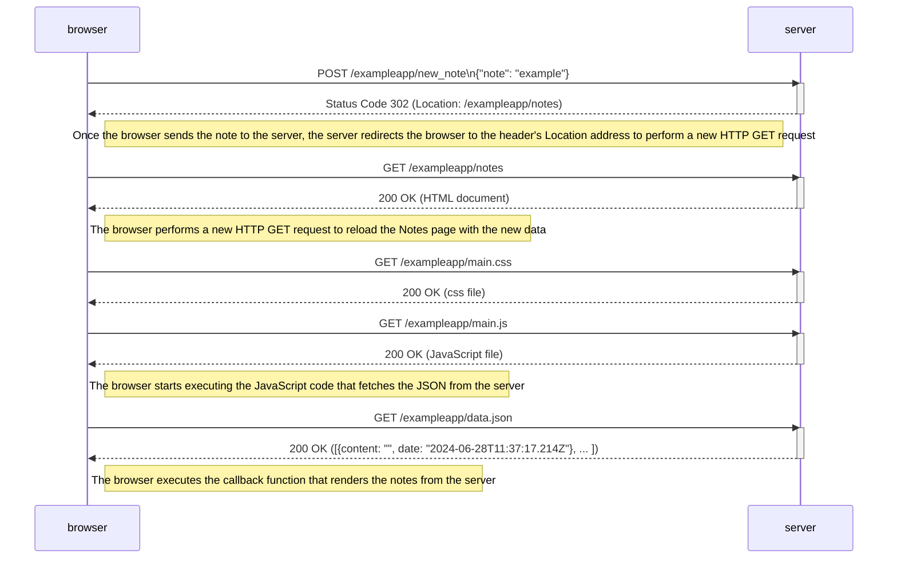

```mermaid
sequenceDiagram
    participant browser
    participant server

    browser->>server: POST /exampleapp/new_note\n{"note": "example"}
    activate server
    server-->>browser: Status Code 302 (Location: /exampleapp/notes)
    deactivate server

    Note right of browser: Once the browser sends the note to the server, the server redirects the browser to the header's Location address to perform a new HTTP GET request

    browser->>server: GET /exampleapp/notes
    activate server
    server-->>browser: 200 OK (HTML document)
    deactivate server

    Note right of browser: The browser performs a new HTTP GET request to reload the Notes page with the new data

    browser->>server: GET /exampleapp/main.css
    activate server
    server-->>browser: 200 OK (css file)
    deactivate server

    browser->>server: GET /exampleapp/main.js
    activate server
    server-->>browser: 200 OK (JavaScript file)
    deactivate server

    Note right of browser: The browser starts executing the JavaScript code that fetches the JSON from the server

    browser->>server: GET /exampleapp/data.json
    activate server
    server-->>browser: 200 OK ([{content: "", date: "2024-06-28T11:37:17.214Z"}, ... ])
    deactivate server

    Note right of browser: The browser executes the callback function that renders the notes from the server
```
