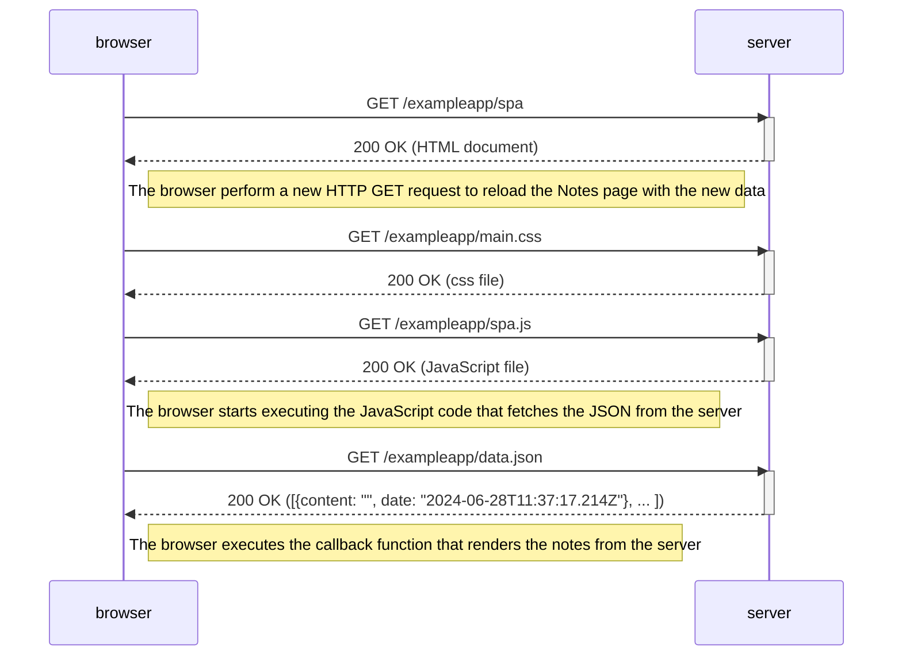

```mermaid
sequenceDiagram
    participant browser
    participant server

    browser->>server: GET /exampleapp/spa
    activate server
    server-->>browser: 200 OK (HTML document)
    deactivate server

    Note right of browser: The browser perform a new HTTP GET request to reload the Notes page with the new data

    browser->>server: GET /exampleapp/main.css
    activate server
    server-->>browser: 200 OK (css file)
    deactivate server

    browser->>server: GET /exampleapp/spa.js
    activate server
    server-->>browser: 200 OK (JavaScript file)
    deactivate server

    Note right of browser: The browser starts executing the JavaScript code that fetches the JSON from the server

    browser->>server: GET /exampleapp/data.json
    activate server
    server-->>browser: 200 OK ([{content: "", date: "2024-06-28T11:37:17.214Z"}, ... ])
    deactivate server

    Note right of browser: The browser executes the callback function that renders the notes from the server
```
