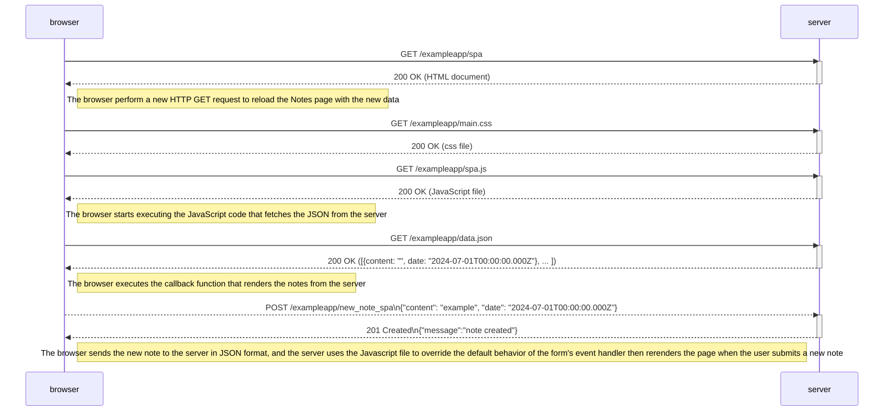

```mermaid
sequenceDiagram
    participant browser
    participant server

    browser->>server: GET /exampleapp/spa
    activate server
    server-->>browser: 200 OK (HTML document)
    deactivate server

    Note right of browser: The browser perform a new HTTP GET request to reload the Notes page with the new data

    browser->>server: GET /exampleapp/main.css
    activate server
    server-->>browser: 200 OK (css file)
    deactivate server

    browser->>server: GET /exampleapp/spa.js
    activate server
    server-->>browser: 200 OK (JavaScript file)
    deactivate server

    Note right of browser: The browser starts executing the JavaScript code that fetches the JSON from the server

    browser->>server: GET /exampleapp/data.json
    activate server
    server-->>browser: 200 OK ([{content: "", date: "2024-07-01T00:00:00.000Z"}, ... ])
    deactivate server

    Note right of browser: The browser executes the callback function that renders the notes from the server

    browser-->>server: POST /exampleapp/new_note_spa\n{"content": "example", "date": "2024-07-01T00:00:00.000Z"}
    activate server
    server-->>browser: 201 Created\n{"message":"note created"}
    deactivate server

    Note right of browser: The browser sends the new note to the server in JSON format, and the server uses the Javascript file to override the default behavior of the form's event handler then rerenders the page when the user submits a new note
```
